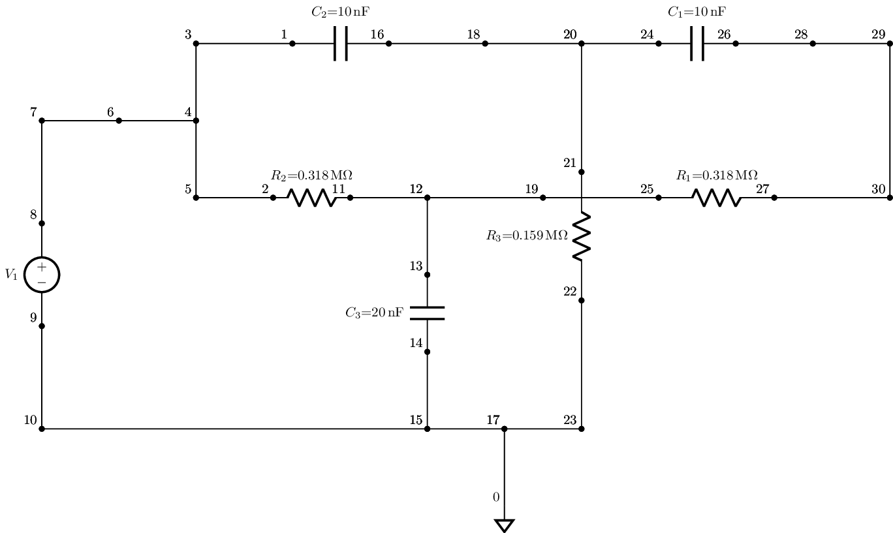

ltparser
========

by Scott Prahl

.. image:: https://img.shields.io/pypi/v/ltparser.svg
   :target: https://pypi.org/project/ltparser/

.. image:: https://colab.research.google.com/assets/colab-badge.svg
   :target: https://colab.research.google.com/github/scottprahl/ltparser/blob/master

.. image:: https://img.shields.io/badge/readthedocs-latest-blue.svg
   :target: https://ltparser.readthedocs.io

.. image:: https://img.shields.io/badge/github-code-green.svg
   :target: https://github.com/scottprahl/ltparser

.. image:: https://img.shields.io/badge/MIT-license-yellow.svg
   :target: https://github.com/scottprahl/ltparser/blob/master/LICENSE.txt

__________

Simple parser for converting LTspice `.asc` files to simple netlists.  Only a
few LTspice elements are currently supported.

Usage
-----

    Example::

        import lcapy
        import ltparser

        lt = ltparser.LTspice()
        lt.read('../tests/ltspice/twin-t.asc')
        lt.make_netlist()
        cct=lt.circuit()
        cct.draw(scale=0.5)

produces

Installation
------------

Source code is available at <https://github.com/scottprahl/ltparser> or the module
can be installed using `pip`::

    pip install ltparser

License
-------
ltparser is licensed under the terms of the MIT license.